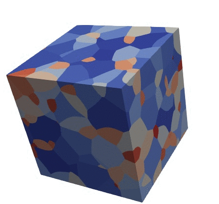

---
hide:
  - toc
---

<div class="hero">
  <div class="hero-content">
    <div class="hero-kicker">Computational scientist and scientific software engineer</div>
    <h1>Dr. Harsh Kumar Narula</h1>
    <h2>Materials science, scientific computing and AI/ML</h2>
    <p>I build <strong>mathematical models, computational algorithms and scientific software</strong> for engineering and materials-science problems.</p>
    <p>My work spans <strong>C++, Python, numerical methods, stochastic simulation, microstructure reconstruction, image analysis and physics-informed modeling</strong>.</p>
    <div class="hero-actions">
      <a class="md-button md-button--primary" href="research/">Explore Research</a>
      <a class="md-button" href="engineering/">Explore Software</a>
      <a class="md-button" href="cv/">View CV</a>
    </div>
  </div>
  <div class="hero-photo">
    
  </div>
</div>

## The intersection

<div class="card-grid">
<a class="hn-card hn-card--featured" href="research/"><span class="card-icon"><svg xmlns="http://www.w3.org/2000/svg" viewBox="0 0 24 24" fill="currentColor"><path d="M5 19a1 1 0 0 0 1 1h12a1 1 0 0 0 1-1c0-.21-.07-.41-.18-.57L13 8.35V4h-2v4.35L5.18 18.43c-.11.16-.18.36-.18.57m1 3a3 3 0 0 1-3-3c0-.6.18-1.16.5-1.63L9 7.81V6a1 1 0 0 1-1-1V4a2 2 0 0 1 2-2h4a2 2 0 0 1 2 2v1a1 1 0 0 1-1 1v1.81l5.5 9.56c.32.47.5 1.03.5 1.63a3 3 0 0 1-3 3zm7-6 1.34-1.34L16.27 18H7.73l2.66-4.61zm-.5-4a.5.5 0 0 1 .5.5.5.5 0 0 1-.5.5.5.5 0 0 1-.5-.5.5.5 0 0 1 .5-.5"/></svg></span><strong>Research</strong><span>Microstructure modeling, reconstruction, tessellation, nucleation-growth and image analysis — the core of my PhD work at IIT Bombay.</span></a>
<a class="hn-card" href="engineering/"><span class="card-icon"><svg xmlns="http://www.w3.org/2000/svg" viewBox="0 0 24 24" fill="currentColor"><path d="m14.6 16.6 4.6-4.6-4.6-4.6L16 6l6 6-6 6zm-5.2 0L4.8 12l4.6-4.6L8 6l-6 6 6 6z"/></svg></span><strong>Scientific software</strong><span>C++, Python, Qt, VTK, ITK, OpenCV, pybind11, CMake and numerical computing.</span></a>
<a class="hn-card" href="ai-ml/"><span class="card-icon"><svg xmlns="http://www.w3.org/2000/svg" viewBox="0 0 24 24" fill="currentColor"><path d="M21.33 12.91c.09 1.55-.62 3.04-1.89 3.95l.77 1.49c.23.45.26.98.06 1.45-.19.47-.58.84-1.06 1l-.79.25a1.687 1.687 0 0 1-1.86-.55L14.44 18c-.89-.15-1.73-.53-2.44-1.1-.5.15-1 .23-1.5.23-.88 0-1.76-.27-2.5-.79-.53.16-1.07.23-1.62.22-.79.01-1.57-.15-2.3-.45a4.1 4.1 0 0 1-2.43-3.61c-.08-.72.04-1.45.35-2.11-.29-.75-.32-1.57-.07-2.33C2.3 7.11 3 6.32 3.87 5.82c.58-1.69 2.21-2.82 4-2.7 1.6-1.5 4.05-1.66 5.83-.37.42-.11.86-.17 1.3-.17 1.36-.03 2.65.57 3.5 1.64 2.04.53 3.5 2.35 3.58 4.47.05 1.11-.25 2.2-.86 3.13.07.36.11.72.11 1.09m-5-1.41c.57.07 1.02.5 1.02 1.07a1 1 0 0 1-1 1h-.63c-.32.9-.88 1.69-1.62 2.29.25.09.51.14.77.21 5.13-.07 4.53-3.2 4.53-3.25a2.59 2.59 0 0 0-2.69-2.49 1 1 0 0 1-1-1 1 1 0 0 1 1-1c1.23.03 2.41.49 3.33 1.3.05-.29.08-.59.08-.89-.06-1.24-.62-2.32-2.87-2.53-1.25-2.96-4.4-1.32-4.4-.4-.03.23.21.72.25.75a1 1 0 0 1 1 1c0 .55-.45 1-1 1-.53-.02-1.03-.22-1.43-.56-.48.31-1.03.5-1.6.56-.57.05-1.04-.35-1.07-.9a.97.97 0 0 1 .88-1.1c.16-.02.94-.14.94-.77 0-.66.25-1.29.68-1.79-.92-.25-1.91.08-2.91 1.29C6.75 5 6 5.25 5.45 7.2 4.5 7.67 4 8 3.78 9c1.08-.22 2.19-.13 3.22.25.5.19.78.75.59 1.29-.19.52-.77.78-1.29.59-.73-.32-1.55-.34-2.3-.06-.32.27-.32.83-.32 1.27 0 .74.37 1.43 1 1.83.53.27 1.12.41 1.71.4q-.225-.39-.39-.81a1.038 1.038 0 0 1 1.96-.68c.4 1.14 1.42 1.92 2.62 2.05 1.37-.07 2.59-.88 3.19-2.13.23-1.38 1.34-1.5 2.56-1.5m2 7.47-.62-1.3-.71.16 1 1.25zm-4.65-8.61a1 1 0 0 0-.91-1.03c-.71-.04-1.4.2-1.93.67-.57.58-.87 1.38-.84 2.19a1 1 0 0 0 1 1c.57 0 1-.45 1-1 0-.27.07-.54.23-.76.12-.1.27-.15.43-.15.55.03 1.02-.38 1.02-.92"/></svg></span><strong>AI / ML</strong><span>Scientifically grounded data-driven methods for materials and industrial R&amp;D.</span></a>
<a class="hn-card" href="projects/"><span class="card-icon"><svg xmlns="http://www.w3.org/2000/svg" viewBox="0 0 24 24" fill="currentColor"><path d="m21.71 20.29-1.42 1.42a1 1 0 0 1-1.41 0L7 9.85A3.8 3.8 0 0 1 6 10a4 4 0 0 1-3.78-5.3l2.54 2.54.53-.53 1.42-1.42.53-.53L4.7 2.22A4 4 0 0 1 10 6a3.8 3.8 0 0 1-.15 1l11.86 11.88a1 1 0 0 1 0 1.41M2.29 18.88a1 1 0 0 0 0 1.41l1.42 1.42a1 1 0 0 0 1.41 0l5.47-5.46-2.83-2.83M20 2l-4 2v2l-2.17 2.17 2 2L18 8h2l2-4Z"/></svg></span><strong>Projects</strong><span>Engineering projects including WinDev and research-oriented software.</span></a>
</div>

## Technical toolbox

<div class="tech-strip">
<span class="tech">C++</span><span class="tech">Python</span><span class="tech">CMake</span><span class="tech">Qt</span><span class="tech">pybind11</span><span class="tech">Cython</span><span class="tech">VTK</span><span class="tech">ITK</span><span class="tech">OpenCV</span><span class="tech">OpenMP</span><span class="tech">OpenBLAS</span><span class="tech">Armadillo</span>
</div>

## Featured research

<div class="research-feature">
<a href="research/PhD/images/image4_orig.gif"></a>
<figcaption>Computationally generated polycrystalline structure from the research archive.</figcaption>
</div>

My PhD research focused on **Mathematical Modeling of Microstructure and Microtexture Evolution**, including reconstruction of 3D polycrystalline structure from grain-volume and centroid statistics.

[Read the research story](research/index.md)

## A computational mindset

```text
Physical problem
      ↓
Mathematical model
      ↓
Numerical algorithm
      ↓
Scientific software
      ↓
Data / visualization
      ↓
Engineering interpretation
```

> **Build the model. Build the algorithm. Build the software. Understand the result.**

## Currently exploring

**AI / ML for scientific and engineering applications**, particularly where data-driven methods can complement mechanistic models and accelerate industrial R&amp;D.

[See AI / ML direction](ai-ml/index.md)
